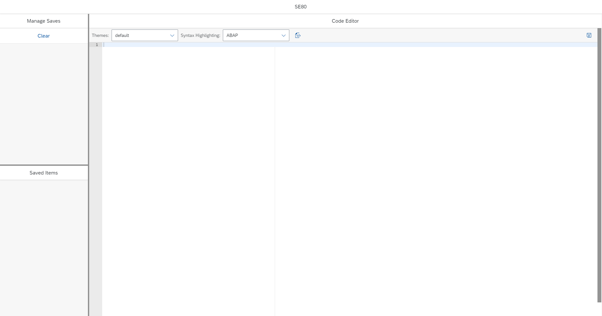
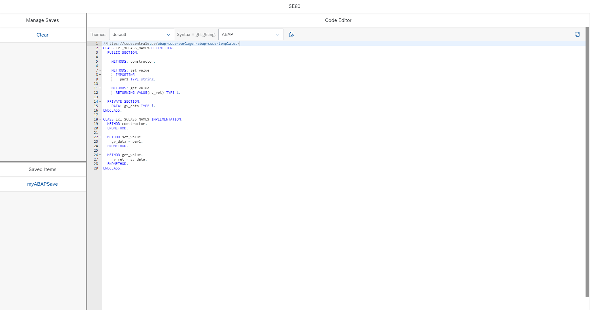

# Introduction

I saw that UI5 offers a 'Code Editor'-Control. So I decided to implement it and try out a few things with it. It's layout is influenced by the SAP system transaction SE80 (IDE).

It implements usage for some basic - already existing (provided by the control itself) - functionality like:

* Syntax Highlighting
* Theming
* Pretty Printing

In addition to that you can save your code snippets into your browser. This is made possible by UI5s [own abstracted implementation of the Web Storage API](https://sapui5.hana.ondemand.com/#/api/module%3Asap%2Fui%2Futil%2FStorage).

It was also the first time for me to implement the [ResponsiveSplitter](https://sapui5.hana.ondemand.com/#/api/sap.ui.layout.ResponsiveSplitter), the Storage utility of UI5 and a few JSON model shenanigans.

# Getting Started
You can just clone this repository, run npm install and use the [UI5 tooling](https://github.com/SAP/ui5-tooling) to locally serve the application in order to debug/learn from it.

Hint: it already uses the livereload-middleware for the [UI5 tooling](https://github.com/SAP/ui5-tooling), so changes while serving will trigger an immediate update in the browser.

1. Clone the repository
    ```sh
    git clone <repository-url>
    ```
1. Navigate into the cloned repository 
    ```sh
    cd <repository>
    ```
1. Install all dependencies
    ```sh
    npm install
    ```
1. Start the application
    ```sh
    npm start
    ```

# Example

## Basic Layout



## Syntax Highlighting



# Credits

* This project has been generated with 💙 and [easy-ui5](https://github.com/SAP)
* [Repository Picture](https://www.msc-mobile.com/blog/5-steps-how-to-convert-an-application-from-web-dynpro-to-sap-ui5.html)